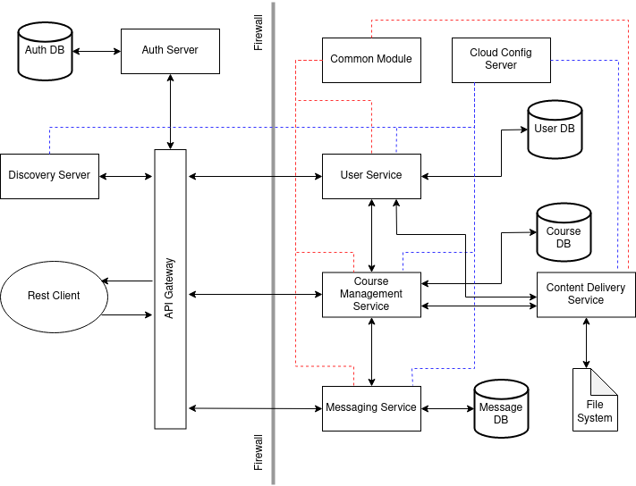

# Backend Service Diagram

# User Service

* Add regular user (No role needed)
* Add admin user info (ADMIN role need)
* Get user info by id (USER/ADMIN role needed)
* Get all regular user info (USER/ADMIN role needed)
* Get all admin user info (USER/ADMIN role needed)
* Get a list of admin/regular user info (USER/ADMIN role needed)
* Update profile information (ADMIN role or user him/herself needed)
* Update profile picture (ADMIN role or user him/herself needed)
* Update password (ADMIN role or user him/herself needed)

# Content Delivery Service

* Store files in the file system
* Retrieve file information from the db

# Course Management Service

* Add course information
* Update course information
* Apply for course enrollment
* Approve course enrollment request
* Add posts to the courses
* Upload contents to the courses
* Fetch posts from the courses
* Download contents from the courses